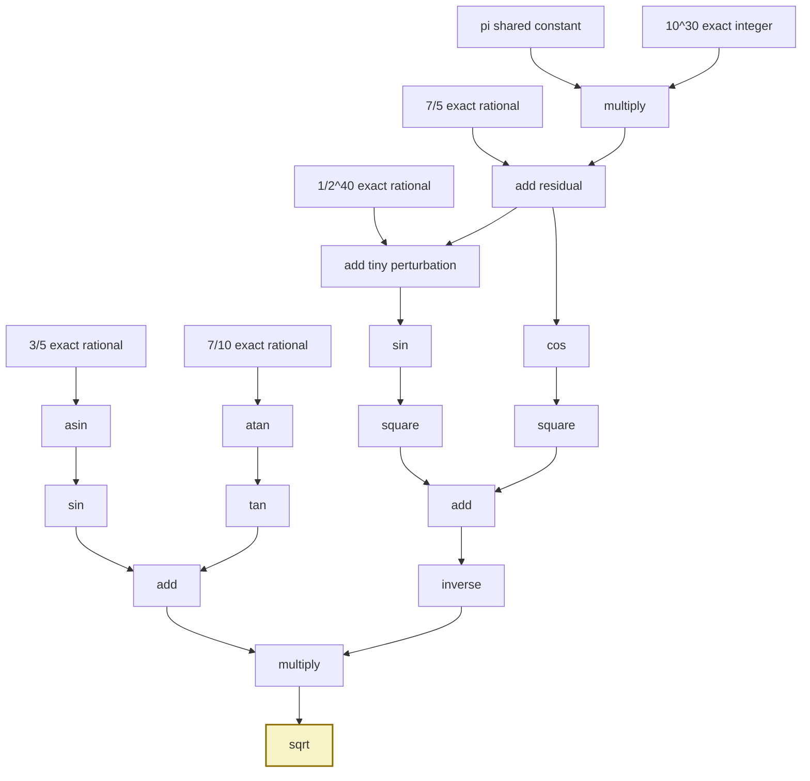
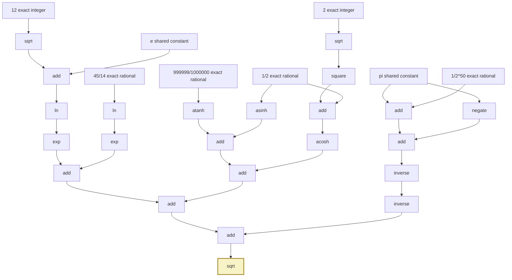
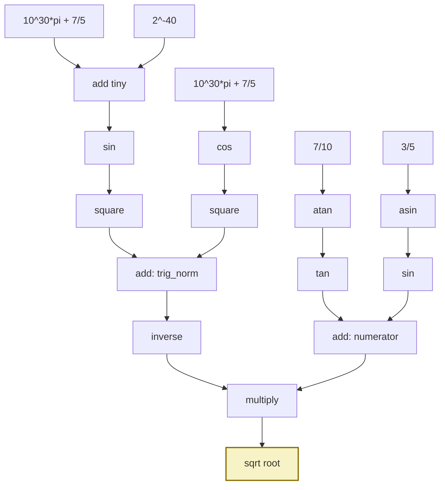
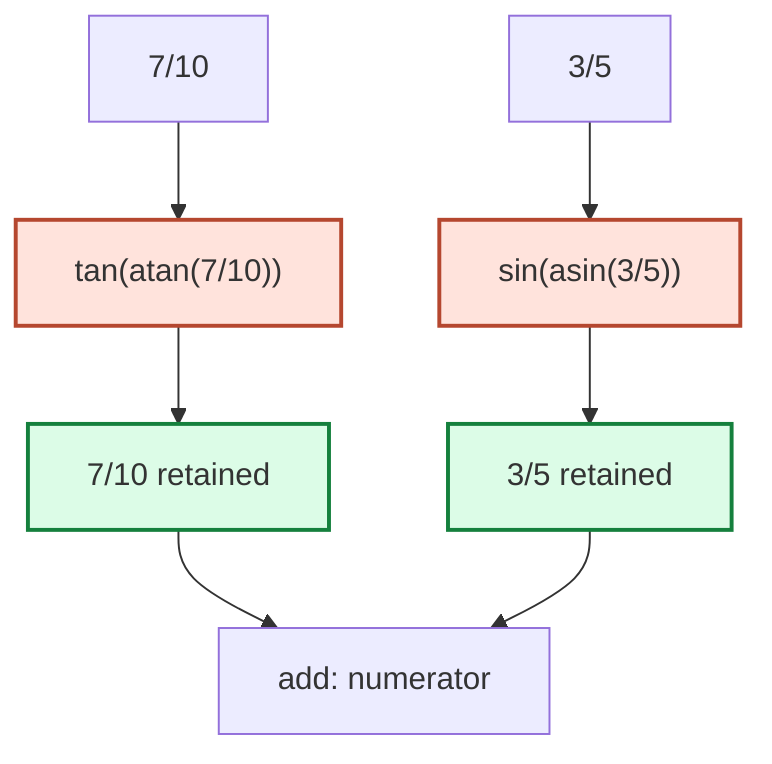
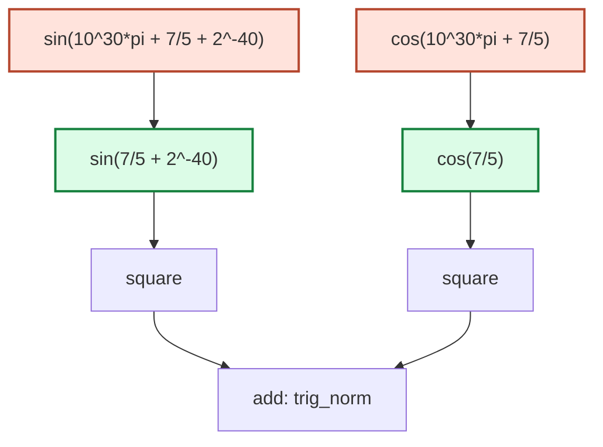

# Computable

`Computable` is the lazy exact-real expression graph. It is used when `Real`
needs a numeric certificate or an approximation path that cannot remain purely
rational/symbolic.

## Representation model

The internal node graph represents constants, exact rational leaves, arithmetic
operations, elementary functions, scale/shift nodes, and specialized kernels.
Nodes carry caches for approximations and conservative facts so repeated
queries do not rebuild work.

`Computable` follows the exact-real arithmetic model: callers request an
approximation at a binary precision, and the graph refines only as much as is
needed for that request.

## Module map

- `mod.rs`: public export and private shared node helpers.
- `node.rs`: compact expression enum, caches, structural facts, graph rewrites,
  constructors, and most high-level methods.
- `approximation.rs`: precision refinement kernels for elementary functions and
  argument reduction.
- `constants.rs`: shared constants and cached named values.
- `format.rs`: formatting support.
- `symbolic.rs`: symbolic helper routines and split points.

## API expectations

- `approx(precision)` returns a scaled integer approximation for the requested
  binary precision.
- repeated approximation requests may use caches, but lower-precision cache
  hits must not corrupt later higher-precision requests.
- sign and magnitude helpers are conservative unless exact structure proves the
  answer.
- constructors should simplify obvious identities before allocating generic
  graph nodes.
- abort-aware paths must check signals at bounded points without changing
  ordinary non-abort semantics.

## Numerical expectations

Approximation kernels should:

- reduce arguments before entering expensive series or transcendental kernels
- use exact/symbolic endpoints where possible
- avoid cancellation-prone forms when a stable transform is available
- reuse shared constants such as `pi`, `tau`, `e`, `sqrt(2)`, `sqrt(3)`, and
  common logarithms
- keep approximation precision explicit rather than silently falling back to
  primitive floating point

## Complex graph examples

The generator in [`../../examples/computable_graphs.rs`](../../examples/computable_graphs.rs)
builds intentionally large public `Computable` expressions, emits Mermaid graph
diagrams, and asks each root for an `approx(-80)` value:

```sh
cargo run --example computable_graphs
```

The generator keeps a tiny parallel graph builder next to the actual
`Computable` values:

```rust
let huge_pi = graph.binary("multiply", &pi, &huge, Computable::multiply);
let phase = graph.binary("add residual", &huge_pi, &seven_fifths, Computable::add);
let phase_plus_tiny = graph.binary("add tiny perturbation", &phase, &tiny, Computable::add);

let sin_phase = graph.unary("sin", &phase_plus_tiny, Computable::sin);
let cos_phase = graph.unary("cos", &phase, Computable::cos);
let atan = graph.unary("atan", &seven_tenths, Computable::atan);
let tan_atan = graph.unary("tan", &atan, Computable::tan);
let asin = graph.unary("asin", &three_fifths, Computable::asin);
let asin_sin = graph.unary("sin", &asin, Computable::sin);

let sin_sq = graph.unary("square", &sin_phase, Computable::square);
let cos_sq = graph.unary("square", &cos_phase, Computable::square);
let trig_norm = graph.binary(
    "add",
    &sin_sq,
    &cos_sq,
    Computable::add,
);
let inverse_norm = graph.unary("inverse", &trig_norm, Computable::inverse);
let numerator = graph.binary("add", &tan_atan, &asin_sin, Computable::add);
let product = graph.binary("multiply", &numerator, &inverse_norm, Computable::multiply);
let root = graph.unary(
    "sqrt",
    &product,
    Computable::sqrt,
);
```

### Argument-reduction tower

This expression stresses large argument reduction and inverse-trig composition:

```text
sqrt((tan(atan(7/10)) + sin(asin(3/5)))
     / (sin(10^30*pi + 7/5 + 2^-40)^2 + cos(10^30*pi + 7/5)^2))
```



Evaluation with `root.approx(-80)` returns the scaled integer
`1398739548397216159170853`, representing roughly:

```text
1.157010236445354561840032
```

The evaluator first uses constructor-time rewrites and structural facts where
available, then the trig kernels reduce the huge `10^30*pi + residual` argument
before requesting the precision needed by the final square-root node. Repeating
the same approximation reuses cached subresults.

### Cancellation and nested-inverse tower

This expression combines exact square rewrites, logs/exponentials, inverse
hyperbolic functions near difficult points, and a near-cancellation that is
inverted twice:

```text
sqrt(
    exp(ln(sqrt(12) + e))
  + exp(ln(45/14))
  + atanh(999999/1000000)
  + asinh(1/2)
  + acosh(sqrt(2)^2 + 1/2)
  + inverse(inverse(pi + 2^-50 - pi))
)
```



Evaluation with `root.approx(-80)` returns the scaled integer
`5227679412026104074933468`, representing roughly:

```text
4.324235058270604318885090
```

The `sqrt(2)^2` and double inverse shapes are candidates for structural
rewrites, while `atanh(999999/1000000)` and the `pi + 2^-50 - pi` branch force
precision planning to respect near-boundary and near-cancellation behavior. The
final `sqrt` asks each child only for enough precision to produce the requested
root approximation.

### Refinement walk

The generator in
[`../../examples/computable_refinement_steps.rs`](../../examples/computable_refinement_steps.rs)
walks the argument-reduction tower through the public inspection and evaluation
steps:

```sh
cargo run --example computable_refinement_steps
```

It builds the same shape as the first graph:

```text
sqrt((tan(atan(7/10)) + sin(asin(3/5)))
     / (sin(10^30*pi + 7/5 + 2^-40)^2 + cos(10^30*pi + 7/5)^2))
```

The example demonstrates most of the Computable lifecycle:

- exact rational leaves report sign, zero status, exact-rational status, and
  exact magnitude without approximation
- the huge phase `10^30*pi + 7/5` is structurally nonzero and positive, with a
  known high most-significant bit
- trig evaluation reduces the huge `pi` multiple to the residual argument
- inverse-function compositions refine back to their rational inputs
- intermediate sums refine at progressively finer binary precisions
- the final root is evaluated at the requested precision and a repeat request
  reuses the cache

The walkthrough prints staged graphs before the numeric output. Nodes in red are
the expression shape being replaced or reduced; green nodes are the retained
reduced form; blue nodes are refinement requests; purple is a repeated cached
request.

Symbolic stage 1 starts with the full expression graph:



Symbolic stage 2 shows inverse-function reduction checks. These are not
floating-point identities; `compare_absolute(..., -64)` asks the computable
values to refine enough to prove equality at that tolerance:



Numeric stage 3 shows argument reduction for the huge trigonometric inputs. The
`10^30*pi` term is reduced away modulo the trig period before the approximation
kernels spend precision on the residual:



Numeric stage 4 shows precision refinement and cache reuse. `approx(p)` returns
an integer scaled by `2^-p`, and each request may refine only as far as needed
for that precision:


Representative output:

```text
residual 7/5:
  facts: sign=positive, zero=nonzero, exact_rational=true, magnitude=msd 0 (exact=true)
  sign_until(-24): Some(Positive)
  approx(-12): 5734
  approx(-24): 23488102

tiny 2^-40:
  facts: sign=positive, zero=nonzero, exact_rational=true, magnitude=msd -40 (exact=true)
  sign_until(-24): Some(Positive)
  approx(-12): 0
  approx(-24): 0

phase = 10^30*pi + 7/5:
  facts: sign=positive, zero=nonzero, exact_rational=false, magnitude=msd 101 (exact=true)
  zero_status: NonZero
  sign_until(0): Some(Positive)

trig_norm:
  facts: sign=unknown, zero=unknown, exact_rational=false, magnitude=unknown
  sign_until(-24): Some(Positive)
  approx(-12): 3978
  approx(-24): 16292542

numerator:
  facts: sign=unknown, zero=unknown, exact_rational=false, magnitude=unknown
  sign_until(-24): Some(Positive)
  approx(-12): 5325
  approx(-24): 21810381

trig_norm refinement:
  approx( -8) = 249
  approx(-16) = 63643
  approx(-32) = 4170890717
  approx(-64) = 17913839226283551985
  decimal = 0.971111170334633746241117

numerator refinement:
  approx( -8) = 333
  approx(-16) = 85197
  approx(-32) = 5583457485
  approx(-64) = 23980767295822417101
  decimal = 1.300000000000000000000000

product before sqrt:
  facts: sign=unknown, zero=unknown, exact_rational=false, magnitude=unknown
  sign_until(-24): None

root:
  facts: sign=unknown, zero=unknown, exact_rational=false, magnitude=unknown
  sign_until(-24): None

final root:
  approx(-80) = 1398739548397216159170853
  decimal = 1.157010236445354561840032

large-argument reduction checks:
  sin(10^30*pi + 7/5 + 2^-40) vs sin(7/5 + 2^-40): equal within tolerance
  cos(10^30*pi + 7/5) vs cos(7/5): equal within tolerance

inverse-function reduction checks:
  tan(atan(7/10)) vs 7/10: equal within tolerance
  sin(asin(3/5)) vs 3/5: equal within tolerance

cache demonstration:
  first approx(-80) = 1398739548397216159170853
  second approx(-80) = 1398739548397216159170853
```

The coarse `tiny` approximations round to zero because `approx(p)` returns the
integer scaled by `2^-p`; the exact structural facts still preserve its positive
nonzero status. The later refinement rows show the same expression family
requesting more binary digits only where the caller asks for them.

## Performance expectations

The fastest `Computable` path is the one never entered because `Rational` or
`Real` answered the question structurally. When a computable graph is required,
prefer shallow rewrites, cached constants, and bounded precision refinement over
eager high-precision evaluation.
